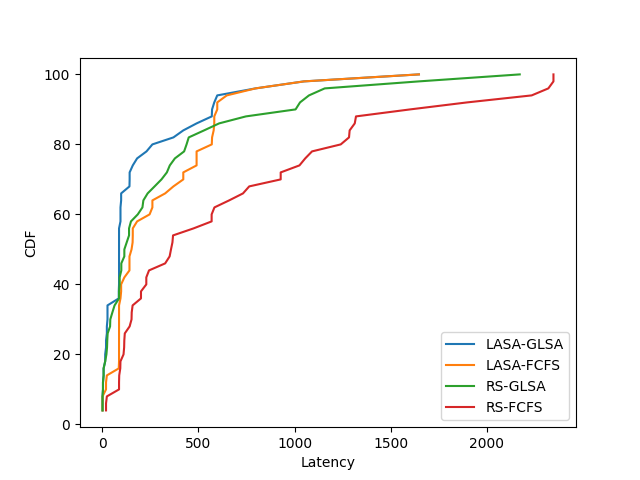

# 说明
我对论文[Luo](https://ieeexplore.ieee.org/abstract/document/9736638)$^{[1]}$的实现，用于**个人研究用途**

数据集来源于论文[Fu](https://www.usenix.org/system/files/hotedge20_paper_fu.pdf)$^{[2]}$。他们的数据集仓库在[这里](https://github.com/depsched/sim)


# 概览
不同算法得到的CDF曲线如下图所示
- LASA、RS是放置算法
- GLSA、FCFS是镜像层序列化下载算法



# 运行
```bash
### 准备数据集
# 1. 若是想采用论文[2]的原始数据，按照论文自己配置mongoDB数据库，然后修改一下data.py中的数据库ip即可

# 或 2. 采用提前准备的数据集
cp -r ./storage_demo ./storage

### 运行
python run.py

### 查看结果
# 生成的图片: ./lat_cdf.png

```


# 参考文献
[1] Lou, Jiong, et al. "Efficient container assignment and layer sequencing in edge computing." IEEE Transactions on Services Computing 16.2 (2022): 1118-1131.

[2] Fu, Silvery, et al. "Fast and efficient container startup at the edge via dependency scheduling." 3rd USENIX Workshop on Hot Topics in Edge Computing (HotEdge 20). 2020.
